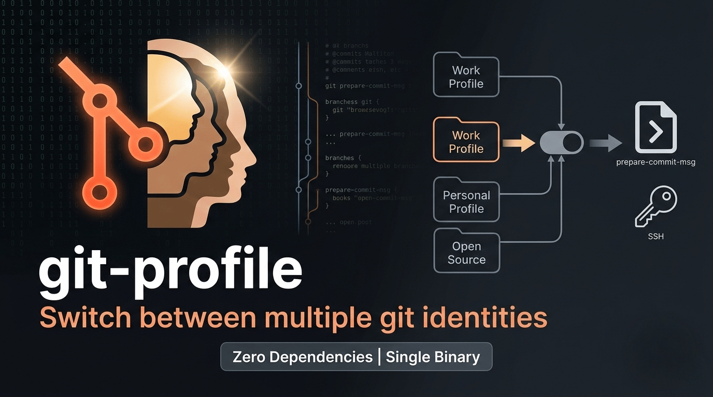

# git-profile



[](https://github.com/hapiio/git-profile/actions/workflows/ci.yml)
[](https://codecov.io/gh/hapiio/git-profile)
[](https://goreportcard.com/report/github.com/hapiio/git-profile)
[](https://github.com/hapiio/git-profile/blob/main/LICENSE)
[](https://github.com/hapiio/git-profile/releases/latest)

**Switch between multiple git identities with a single command.**

Do you juggle work, personal, and open-source git accounts? `git-profile` lets you define named identity profiles and apply them per-repo or globally — so you never accidentally push a personal commit with your work email again.

## Features

- **Named profiles** — store `user.name`, `user.email`, SSH key, and GPG signing per identity
- **Per-repo or global** — apply any profile locally or to `~/.gitconfig`
- **Auto-apply via git hooks** — `prepare-commit-msg` and `pre-push` hooks enforce the right identity before every commit and push
- **Interactive picker** — numbered menu when you can't remember the ID
- **Import existing identity** — bootstrap a profile from your current git config in one command
- **Edit, rename, remove** — full profile lifecycle management
- **Shell completions** — bash, zsh, and fish
- **Zero runtime dependencies** — single static binary, no runtime required

## Quick example

```bash
# Add your profiles
git-profile add --id work     --name "Jane Dev" --email jane@company.com
git-profile add --id personal --name "Jane Doe" --email jane@example.com \
                               --ssh-key ~/.ssh/id_ed25519_personal

# Apply a profile to the current repo
git-profile use work

# See what's active
git-profile current
```

[Get started :material-arrow-right:](installation.md){ .md-button .md-button--primary }
[View on GitHub :material-github:](https://github.com/hapiio/git-profile){ .md-button }
